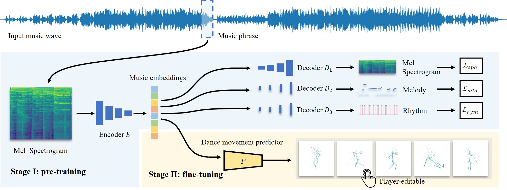

# Automatic Translation of Music-to-Dance for In-Game Characters

[[Paper](TODO)] [[Supp](pdfs/supp.pdf)]

## <u>Abstract</u>

Music-to-dance translation is an emerging and powerful feature in recent role-playing games. Previous works of this topic consider music-to-dance as a supervised motion generation problem based on time-series data. However, these methods require a large amount of training data pairs and may suffer from the degradation of movements. This paper provides a new solution to this task where we re-formulate the translation as a piece-wise dance phrase retrieval problem based on the choreography theory. With such a design, players are allowed to optionally edit the dance movements on top of our generation while other regression-based methods ignore such user interactivity. Considering that the dance motion capture is expensive that requires the assistance of professional dancers, we train our method under a semi-supervised learning fashion with a large unlabeled music dataset (20x than our labeled one) and also introduce self-supervised pre-training to improve the training stability and generalization performance. Experimental results suggest that our method not only generalizes well over various styles of music but also succeeds in choreography for game players.

## <u>Large-scale music dataset</u>

https://drive.google.com/file/d/17qfDWC0ljy0JrxnDueuaU45S14RGu6BB/view?usp=sharing

## <u>Citation</u>

*TODO*
